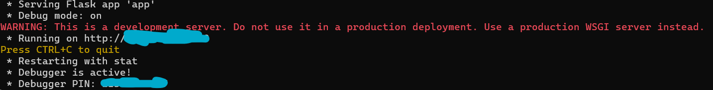

# Car-Model-Lookup-with-LRU-Cache

**SETUP**

This program makes use of Flask to run the application. If you do not have Flask installed already you can do so on your command line by entering the following command:

`pip install flask`

IF YOU HAVE GIT:

Once Flask is installed onto your local machine, create a new folder where you can store the cloned folder of this repository.
Once you created the new folder, right click and then select "Open in Terminal". The terminal will be in the directory with which you opened from.

Next, run the following command in the terminal

`git clone https://github.com/smm2005/Car-Model-Lookup-with-LRU-Cache.git`

This command will create a folder in the directory with the name "Car-Model-Lookup-with-LRU-Cache".

Then run the command

`cd Car-Model-Lookup-with-LRU-Cache`

Once this command runs, you will be in the directory with that name. To compile and execute the web application, run the following command:

`python webapp/app.py`

When this command runs, the following window will appear:

To open the webapp from here, either hover over the link starting with (http:) and then hold the Control key + left click or copy the link and paste into a web browser.

------------------------------------------------------------------------------------------

IF YOU DO NOT HAVE GIT:

Install this repository as a zipped folder by clicking on the green "Code" button then pressing "Download ZIP", then extract the contents of the said zip folder with any desired archiver of your choice (I like to use WinRAR).

When you double click on the extracted folder you will see a "webapp" folder, do not worry about this for now.

Right click on space somewhere along the directory and then click "Open in Terminal"

Run the following command in the terminal

`python webapp/app.py`

When this command runs, the following window will appear:

To open the webapp from here, either hover over the link starting with (http:) and then hold the Control key + left click or copy the link and paste into a web browser.

**COMPONENT**

This webapp consists of Flask to facilitate back-end Python code to the front-end design made with HTML and CSS. In JavaScript, jQuery, more specifically AJAX, is used to handle communication between inputs handled by the HTML, CSS and JavaScript trio and the outputs processed by Python code, where the outputs are returned for display into the web application. Originally the car model finder was meant to be terminal line but seeing that website would serve as a more viable UI to look up car models based on the car make and car year I decided to use Flask to integrate the back-end code with the web development trio (HTML, CSS and JavaScript).

The web application also takes advantage of car model CSVs separated on a yearly basis which I obtained from Abhilash Reddy's (abhionlyone) repository on yearly car data in the United States. The repository can be found in the link below:

https://github.com/abhionlyone/us-car-models-data

The model CSVs go as far back as 25 years, dating from 1999.

More importantly, I designed a doubly-linked list with a custom Node class and then used the aforementioned doubly-linked list in the LRU cache design. The doubly-linked list contains a capacity feature where nodes at the end of the list are evicted upon the appending of a new node to the list head. Despite the sequential access of a doubly-linked list, the list is useful as operations done on linked lists take up a space complexity of O(1) since the only changes occur with values already present in the linked list nodes.

**USE OF LRU CACHE**

Work In Progress